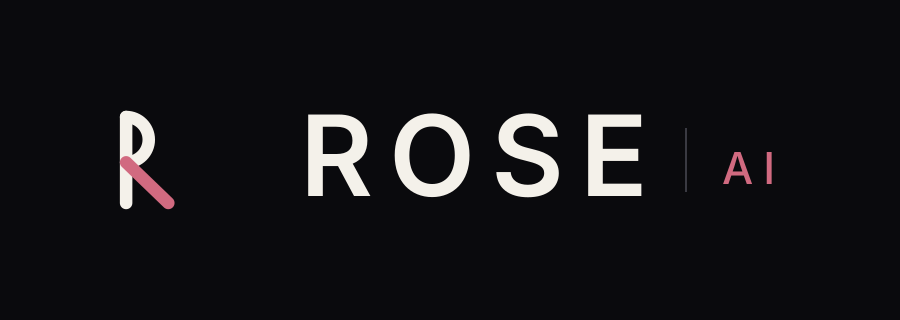

# ROSE

自包含的**本地多角色 AI 智能体桌面应用**，唯一执行引擎是
[codex](https://github.com/openai/codex) 的 `app-server`。
支持 **macOS (Apple Silicon)** 与 **Windows 10/11 (x64)**。

模型 API Key 只存本地；不需要 `~/.codex`，也不需要预先安装任何 agent 框架。

## 功能

- **多角色**：每个角色独立人格（`soul.md`）、记忆、技能与 MCP 绑定，互不污染
- **按轮切换**：模型 / 供应商 / 沙箱级别 / 审批策略每轮注入，换模型无需重启
- **原生沙箱**：macOS 用系统 seatbelt；Windows 用 codex 原生沙箱
- **技能与 MCP**：可导入 zip 技能并按角色绑定；MCP 支持 stdio / HTTP / SSE

## 安装

需要 Node ≥ 22.15（仅用于安装依赖与脚本；应用运行时不需要 Node）。

```bash
git clone <repo> && cd <repo>
npm run install      # 安装依赖：自动探测并选择 npm registry 与 Electron 下载通道
npm run setup        # 拉取当前平台的 codex 引擎二进制（SHA256 校验）
npm run start        # 启动
```

首次使用：**设置 → 模型配置** 新增 Provider 并填入 API Key、启用模型 → 新建会话，选角色与模型即可对话。
Windows 首次会提示初始化沙箱（`elevated` 需一次管理员授权；也可改用 `unelevated`）。
环境自检：`npm run doctor`。

## 许可

[MIT](LICENSE)。第三方组件与随仓库分发的默认技能许可见 [THIRD-PARTY.md](THIRD-PARTY.md)。
本仓库**不分发**任何二进制（codex / Electron / 工具），运行时按需拉取并校验。
